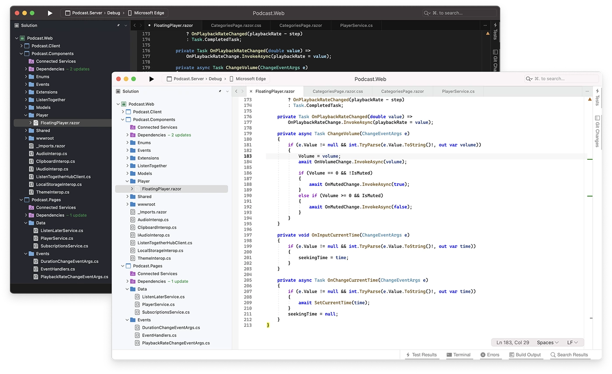

## 1.5 - L'installation de .NET

Pour commencer à développer en C#, il faut installer le SDK .NET. Le SDK .NET est un ensemble d'outils permettant de développer des applications .NET. Il contient notamment le compilateur C# et les outils de débogage.

### Télécharger le SDK .NET

Pour installer le SDK .NET, il faut se rendre sur la page de téléchargement de .NET : [https://dotnet.microsoft.com/download](https://dotnet.microsoft.com/download), Veillez à télécharger la version la plus récente du SDK .NET.

### Installer le SDK .NET

Une fois le fichier d'installation téléchargé, il suffit de l'exécuter pour lancer l'installation du SDK .NET.

### Vérifier l'installation du SDK .NET

Pour vérifier que le SDK .NET est bien installé, il suffit d'ouvrir un terminal et de taper la commande suivante :

```bash
dotnet --version
```

Si le SDK .NET est bien installé, la commande affichera la version du SDK .NET installé.

### Installer un éditeur de code

Vous pouvez choisir l'éditeur ou l'environnement de développement intégré (IDE) de votre choix pour écrire du code en C#. Voici une liste d'éditeurs de code et d'IDE populaires pour le développement en C# :

#### Visual Studio

L'éditeur de code par défaut pour coder en C# est Visual Studio. Vous pouvez le télécharger sur le site officiel de Microsoft : [https://visualstudio.microsoft.com/fr/](https://visualstudio.microsoft.com/fr/)



#### Visual Studio Code

Vous pouvez également utiliser Visual Studio Code qui est un éditeur de code gratuit et open source développé par Microsoft. Vous pouvez le télécharger sur le site officiel de Visual Studio Code : [https://code.visualstudio.com/](https://code.visualstudio.com/)


Pour faire du C# dans les meilleures conditions avec Visual Studio Code, l'installation de l'extension C# est nécessaire. Pour cela, il suffit de cliquer sur l'onglet "Extensions" dans la barre latérale gauche de Visual Studio Code et de rechercher "C#" dans la barre de recherche. L'extension "C#" de Microsoft devrait apparaître en premier, il suffit de cliquer sur "Installer" pour installer l'extension.

Voici une suggestion d'extensions pour Visual Studio Code :

- C#
- C# Dev kit
- Error Lens
- Better Comments
- IntelliCode
- Path Intellisense
- .NET Core Test Explorer
- Auto-Using for C#
- MSBuild project tools
- NuGet Package Manager
- C# Namespace Autocompletion

#### Rider

Vous pouvez également utiliser Rider qui est un IDE développé par JetBrains. Vous pouvez le télécharger sur le site officiel de Rider : [https://www.jetbrains.com/rider/](https://www.jetbrains.com/rider/)


Si vous souhaitez avoir un IDE plus complet que Visual Studio Code, Rider est une très bonne alternative surtout si vous êtes sous MacOS ou Linux car Visual Studio est mal intégré à ces systèmes d'exploitation ou si vous utilisez déjà un IDE JetBrains comme IntelliJ IDEA ou PyCharm.
