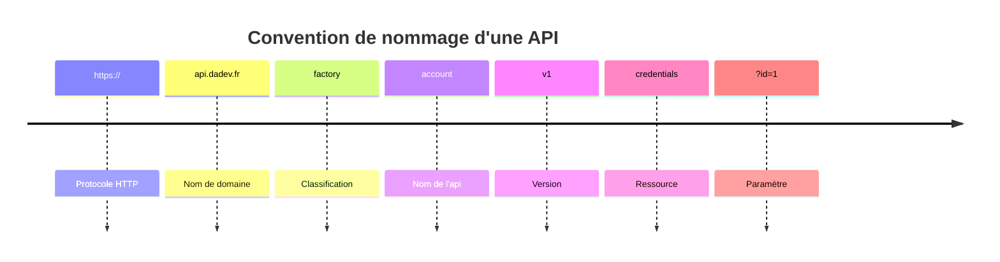

Les conventions API se révèlent être un point important dans la conception d'une API, notamment pour la maintenabilité de l'API et sa compréhension par les développeurs qui l'utiliseront.

## Convention de méthode HTTP

Les méthodes HTTP sont utilisées pour définir l'action à effectuer sur une ressource.

Voici un tableau récapitulatif des méthodes HTTP et de leur utilisation :

| **Méthode**  | **Utilisation**                                     | **Exemple**                               |
| ------------ | --------------------------------------------------- | ----------------------------------------- |
| **`GET`**    | Récupérer une ressource                             | Récupérer la liste des utilisateurs       |
| **`POST`**   | Créer une ressource                                 | Créer un utilisateur                      |
| **`PUT`**    | Modifier la majorité ou la totalité d'une ressource | Modifier un utilisateur                   |
| **`PATCH`**  | Modifier partiellement une ressource                | Modifier le mot de passe de l'utilisateur |
| **`DELETE`** | Supprimer une ressource                             | Supprimer un utilisateur                  |

Chaque méthode HTTP doit être utilisée pour une action précise, il est donc important de respecter cette convention.

De la même manière, chaque méthode HTTP ne doit pas renvoyer les mêmes codes de statut HTTP.

Voici un tableau récapitulatif des méthodes HTTP et des codes qu'elles peuvent renvoyer :

| **Code de statut** | **`200`** | **`201`** | **`202`** | **`204`** | **`400`** | **`401`** | **`403`** | **`404`** | **`500`** |
| ------------------ | --------- | --------- | --------- | --------- | --------- | --------- | --------- | --------- | --------- |
| **`GET`**          | **✔**     |           |           |           | **✔**     | **✔**     | **✔**     | **✔**     | **✔**     |
| **`POST`**         | **✔**     | **✔**     |           | **✔**     | **✔**     | **✔**     | **✔**     |           | **✔**     |
| **`PUT`**          | **✔**     |           | **✔**     | **✔**     | **✔**     | **✔**     | **✔**     |           | **✔**     |
| **`PATCH`**        | **✔**     |           |           | **✔**     | **✔**     | **✔**     | **✔**     |           | **✔**     |
| **`DELETE`**       | **✔**     |           |           | **✔**     | **✔**     | **✔**     | **✔**     |           | **✔**     |

## Convention de nommage

Les conventions de nommage sont importantes pour la compréhension du code et de l'API.

### Convention de nommage de l'API

Chaque partie de l'URL respecte une convention :

- **`Le Protocole HTTP`** : Le protocole doit être HTTPS pour des raisons de sécurité.
- **`Le nom de domaine`** : Le nom de domaine reste à la discrétion du développeur, il est cependant conseillé d'utiliser un nom de domaine en rapport avec le projet.
- **`La classification`** : La classification permet de classer les différentes API d'un même projet. Elle peut être utilisée pour différencier les API publiques des API privées par exemple.
- **`Le nom de l'API`** : Le nom de l'API doit être en rapport avec les ressources qu'elle expose.
- **`La version`** : La version de l'API doit être indiquée dans l'URL pour permettre aux utilisateurs de l'API de savoir quelle version ils utilisent.
- **`La ressource`** : La ressource doit être en rapport avec les données qu'elle expose.
- **`Les paramètres`** : Les paramètres doivent être utilisés pour filtrer les données renvoyées par l'API.

### Convention de nommage d'accès aux ressources

- **`GET/shoes`** : Retourne la liste des chaussures.
- **`GET/shoes/12`** : Retourne la chaussure dont l'identifiant est `12`.
- **`GET/shoes/?size=42&color=red`** : Retourne la liste des chaussures rouges de taille 42.
- **`GET/shoes?color=red`** : Retourne la liste des chaussures rouges.
- **`POST/shoes`** : Crée une nouvelle chaussure.
- **`POST/login`** : Permet de se connecter et de récupérer un token d'authentification.
- **`PUT/shoes/12`** : Modifie la majorité des informations la chaussure dont l'identifiant est `12`.
- **`PATCH/shoes/12`** : Modifie partiellement la chaussure dont l'identifiant est `12`.
- **`DELETE/shoes/12`** : Supprime la chaussure dont l'identifiant est `12`.
