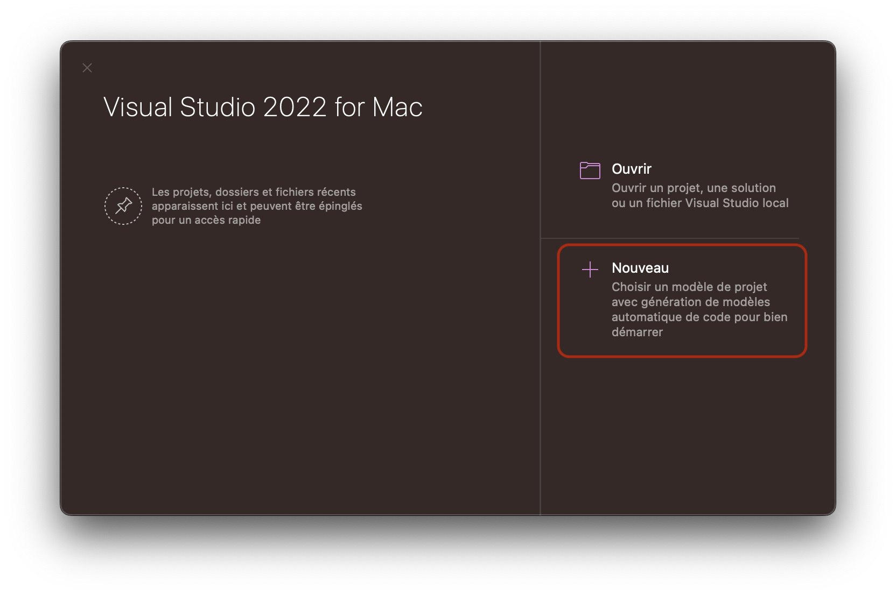
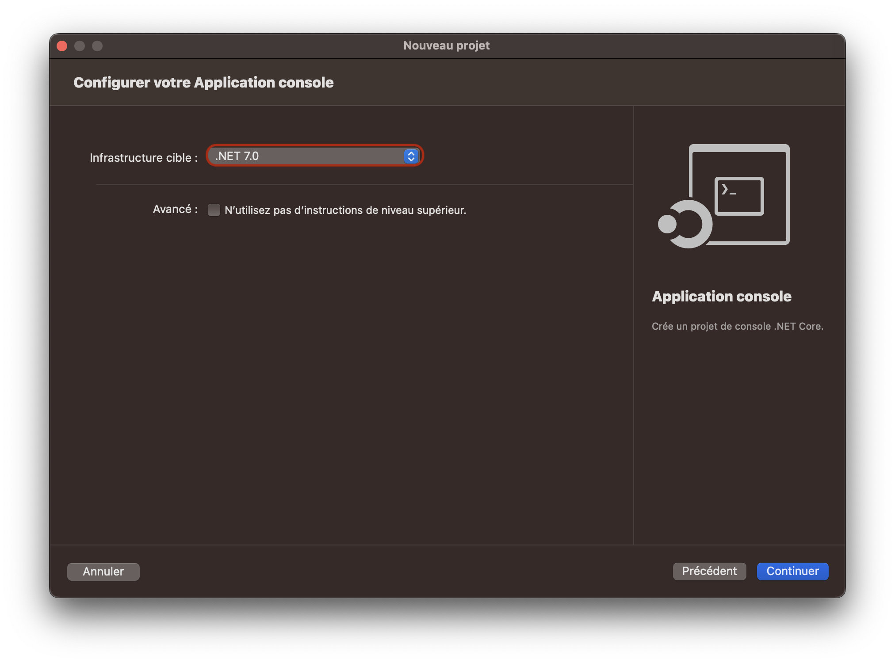
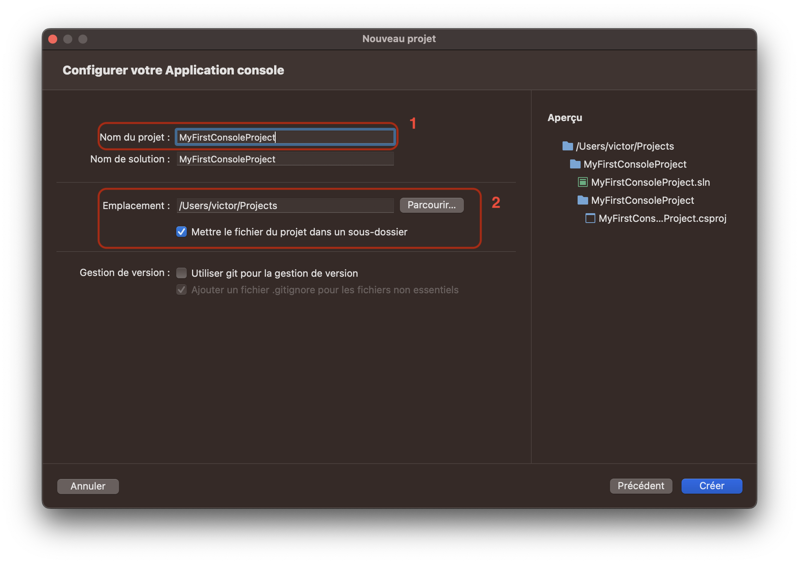
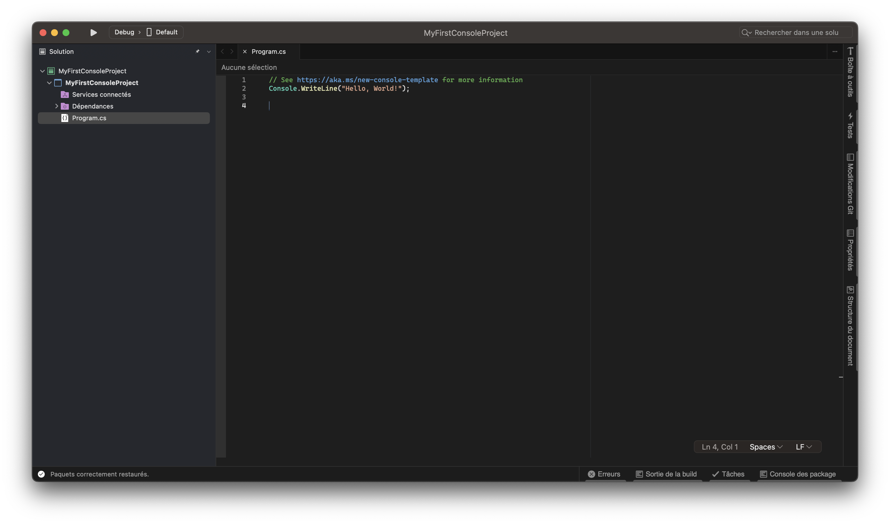

## Créer un projet C#

Il existe plusieurs façons de créer un projet en C#. Nous allons voir ici les deux principales façons de créer un projet en C#, avec le CLI .NET et avec un IDE.

### Créer un projet avec le CLI .NET

Après avoir installé le SDK .NET Core, dans le dernier chapitre, vous avez maintenant accès à la palette de commande `dotnet` dans votre terminal. Cette commande peut vous servir à créer un nouveau projet C#.

Le CLI .NET permet de créer des projets C# avec des templates. Ces templates sont des modèles de projets préconfigurés. Il existe plusieurs templates différents, pour créer des projets de console, des projets web, des projets de bibliothèques, etc.

Voici une liste des templates les plus utilisés:

| Mot clé        | Template            | Description                                                            |
| -------------- | ------------------- | ---------------------------------------------------------------------- |
| `console`      | Console Application | Crée un projet de console C# (application en ligne de commande)        |
| `classlib`     | Class Library       | Crée un projet de bibliothèque C#                                      |
| `web`          | Web                 | Crée un projet web C# vide avec ASP.NET                                |
| `webapi`       | Web / API           | Crée un projet web C# avec ASP.NET                                     |
| `mvc`          | MVC                 | Crée un projet web C# avec ASP.NET qui inclut un pattern MVC           |
| `blazorserver` | Web / Blazor        | Crée un projet web C# avec ASP.NET qui inclut un pattern Blazor Server |
| `xunit`        | xUnit Test          | Crée un projet de tests unitaires avec xUnit                           |

Il existe également d'autres templates, vous pourrez tous les retrouver avec la commande :

```bash
# .NET < 7.0
dotnet new --list

# .NET >= 7.0
dotnet new list
```

:::info
Il es également possible d'utiliser des templates personnalisés et d'en créer mais nous n'aborderons pas ce sujet ici.
:::

Pour créer un projet C# avec le CLI .NET, il suffit d'utiliser la commande `dotnet new` suivie du template souhaité dans le dossier où l'on souhaite placer notre projet. Par exemple, pour créer un projet de console C#, il suffit d'utiliser la commande suivante:

```bash
dotnet new console
```

Cette commande va créer un projet de console C# dans le dossier courant. Le CLI .NET va le projet (celui-ci aura le nom du dossier dans lequel il a été créer par défaut) et y placer tous les fichiers nécessaires à la compilation et à l'exécution du projet.

:::tip
Il est possible de spécifier le nom du projet avec l'option `--name` ou `-n` de la commande `dotnet new`. Par exemple, pour créer un projet de console C# avec le nom `MyProject`, il suffit d'utiliser la commande suivante:

```bash
dotnet new console --name MyProject
```

:::

### Créer un projet avec un IDE (Visual Studio)

Commencez par ouvrir Visual Studio. Vous devriez arriver sur la page d'accueil de Visual Studio.

1. Dans la fenêtre d'accueil, cliquez sur `Nouveau`. 
2. Dans la fenêtre qui s'ouvre vous serez alors invité à choisir un template de projet, vous retrouvez ici les templates qui sont également disponibles avec le CLI .NET.
   - 1 : Choissez la catégorie de projet que vous souhaitez créer
   - 2 : Choisissez le template de projet que vous souhaitez créer en faisant attention à choisir C# comme langage
     
3. Choissisez ensuite la version de .NET que vous souhaitez utiliser pour votre projet, choisissez toujours la dernière version stable installée. 
4. Choisissez le nom de votre projet et l'emplacement où vous souhaitez le créer.
   - 1 : Choisissez le nom de votre projet
   - 2 : Choisissez l'emplacement où vous souhaitez créer votre projet
     
5. Votre projet est maintenant créé, vous pouvez commencer à coder !
   

## Utiliser le CLI .NET

Le CLI .NET est un outil qui permet de créer des projets, de les compiler, de les exécuter, de les publier, etc.
Nous allons voir ici les commandes les plus utiles du CLI .NET.

Pour créer un projet, reportez-vous à la section [Créer un projet avec le CLI .NET](#créer-un-projet-avec-le-cli-net).

### Éxécuter un projet

Les IDE Visual Studio et Rider permettent d'exécuter un projet C# directement depuis l'IDE. Cependant, il est également possible d'exécuter un projet C# avec le CLI .NET.

Pour exécuter un projet C# avec le CLI .NET, il suffit d'utiliser la commande `dotnet run` dans le dossier du projet. Par exemple, pour exécuter un projet de console C#, il suffit d'utiliser la commande suivante:

```bash
dotnet run
```

Cette commande va compiler le projet et l'exécuter. Si le projet est un projet de console, le CLI .NET va afficher le résultat de l'exécution du projet dans le terminal.

### Compiler (Build) un projet

Compiler un projet permet de vérifier que le code est correct et de générer un exécutable.

Les IDE Visual Studio et Rider permettent de compiler un projet C# directement depuis l'IDE. Cependant, il est également possible de compiler un projet C# avec le CLI .NET.

Pour compiler un projet C# avec le CLI .NET, il suffit d'utiliser la commande `dotnet build` dans le dossier du projet. Par exemple, pour compiler un projet de console C#, il suffit d'utiliser la commande suivante:

```bash
dotnet build
```

Cette commande va compiler le projet. Si le projet est un projet de console, le CLI .NET va afficher le résultat de la compilation dans le terminal.

### Publier un projet

Publier un projet permet de créer un exécutable dans un dossier qui contiendra toutes les dépendances du projet en vue de le déployer sur un serveur ou de le distribuer.

Pour publier un projet C# avec le CLI .NET, il suffit d'utiliser la commande `dotnet publish` dans le dossier du projet.

Mais on passe généralement des options à la commande `dotnet publish` pour spécifier le type de publication que l'on souhaite effectuer. Voici les options les plus utilisées:

| Option             | Description                                                                                                                              | Valeurs possibles                      | Valeur par défaut |
| ------------------ | ---------------------------------------------------------------------------------------------------------------------------------------- | -------------------------------------- | ----------------- |
| `-c`               | Spécifie la configuration de publication, debug correspond à une publication de développement et release à une publication de production | `Debug`, `Release`                     | `Debug`           |
| `-r`               | Spécifie la plateforme cible de publication                                                                                              | `win-x64`, `linux-x64`, `osx-x64`, ... | `win-x64`         |
| `-o`               | Spécifie le dossier de sortie de la publication                                                                                          | `chemin/vers/dossier`                  | `./bin`           |
| `--self-contained` | Spécifie si la publication doit être autoportante ou non                                                                                 | `true`, `false`                        | `false`           |

Les autres options sont disponibles dans la [documentation officielle](https://learn.microsoft.com/fr-fr/dotnet/core/tools/dotnet-publish#options) du CLI .NET.

Par exemple, pour publier un projet de console C# en autoportant pour MacOS avec une architecture ARM64 en mode release dans le dossier `./bin` du projet, il suffit d'utiliser la commande suivante:

```bash
dotnet publish -c Release -r osx.13-arm64 --self-contained
```

Cette commande va compiler le projet et créer un exécutable dans le dossier `./bin` du projet.

### Ajouter une dépendance

Pour ajouter une dépendance à un projet C#, il suffit d'utiliser la commande `dotnet add package` dans le dossier du projet. Par exemple, pour ajouter la dépendance `Newtonsoft.Json` à un projet de console C#, il suffit d'utiliser la commande suivante:

```bash
dotnet add package Newtonsoft.Json
```

Cette commande va ajouter la dépendance `Newtonsoft.Json` au projet.

### Supprimer une dépendance

Pour supprimer une dépendance à un projet C#, il suffit d'utiliser la commande `dotnet remove package` dans le dossier du projet. Par exemple, pour supprimer la dépendance `Newtonsoft.Json` à un projet de console C#, il suffit d'utiliser la commande suivante:

```bash
dotnet remove package Newtonsoft.Json
```

Cette commande va supprimer la dépendance `Newtonsoft.Json` au projet.

### Restaurer les dépendances

Pour restaurer les dépendances d'un projet C#, il suffit d'utiliser la commande `dotnet restore` dans le dossier du projet. Par exemple, pour restaurer les dépendances d'un projet de console C#, il suffit d'utiliser la commande suivante:

```bash
dotnet restore
```

Cette commande va restaurer (télécharger) les dépendances du projet.
