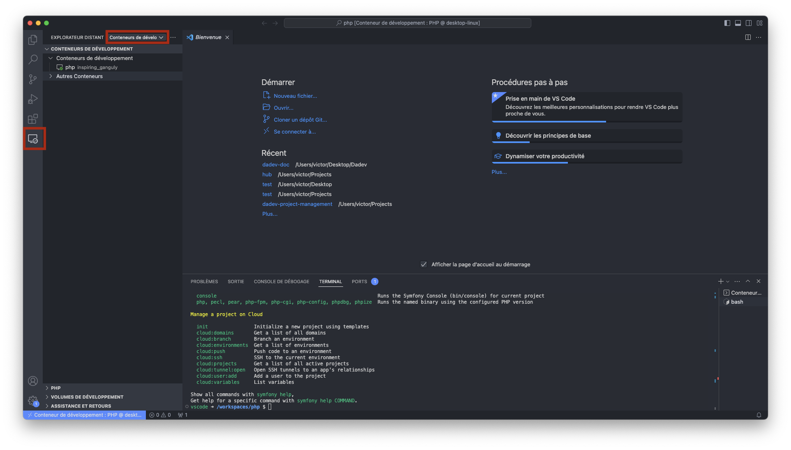
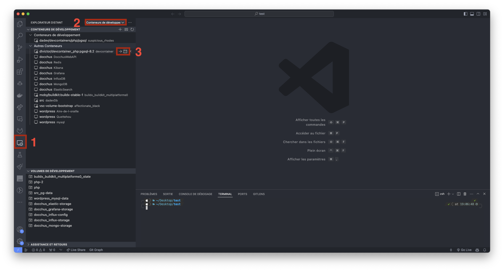
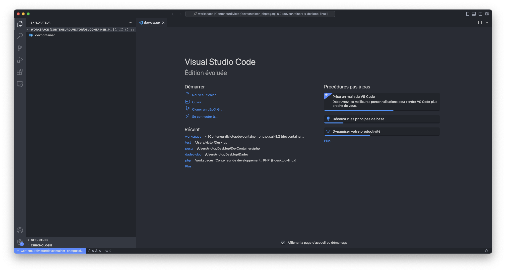

PHP évoluant souvent et les versions n'étant pas toujours compatibles entre elles, il est préférable d'utiliser une solution qui nous permettra de versionner notre environnement de développement. Pour cela, nous allons utiliser Docker.

## Installation de Docker

Docker est disponible sous deux formes :

- **Docker Desktop** : avec une interface graphique pour le travail en local
- **Docker Engine** : pour le travail en ligne de commande (serveur, CI/CD, etc.)

Ici, nous allons utiliser Docker Desktop.

Docker va nous permettre de créer des environnements de développement isolés, appelés conteneurs, qui vont nous permettre de travailler sur des projets PHP sans avoir à installer PHP sur notre machine.

Trois termes sont importants à connaître avec Docker :

- **Image** : c'est un modèle de conteneur, il contient tout les informations dont un programme a besoin pour s'exécuter, y compris le code source, les bibliothèques, les dépendances et les fichiers de configuration.
- **Conteneur** : c'est une instance en cours d'exécution d'une image Docker. Il s'agit d'un environnement isolé qui exécute une application de manière autonome, sans interférer avec d'autres conteneurs ou le système hôte.
- **Dockerfile** : c'est un fichier texte qui contient des instructions pour construire une image Docker. Il spécifie les étapes nécessaires pour configurer l'environnement et préparer l'image de base.

Pour installer Docker, il faut se rendre sur le site officiel de Docker et suivre les instructions d'installation pour votre système d'exploitation : [https://docs.docker.com/get-docker/](https://docs.docker.com/get-docker/)

## Préparation de l'IDE

Pour ce cours, nous allons utiliser Visual Studio Code (VSCode) comme IDE. Il est disponible pour Windows, Mac et Linux.

Pour installer VSCode, il faut se rendre sur le site officiel de VSCode et suivre les instructions d'installation pour votre système d'exploitation : [https://code.visualstudio.com/](https://code.visualstudio.com/)

Une fois VSCode installé, nous allons installer les extensions nécessaires pour travailler avec Docker :

- [Remote Development Pack](https://marketplace.visualstudio.com/items?itemName=ms-vscode-remote.vscode-remote-extensionpack) : pour travailler sur des projets distants (serveur, conteneur, etc.)
- [Docker](https://marketplace.visualstudio.com/items?itemName=ms-azuretools.vscode-docker) : pour travailler avec Docker

Vous devrez peut-être redémarrer VSCode pour que les extensions soient prises en compte.

Une fois les extensions installées, vous devriez voir une nouvelle icône dans la barre latérale de VSCode.

En cliquant sur cette icône, vous devriez voir un menu dans lequel vous pouvez choisir entre des environnements de développement distant (Télécommandes) ou dans des conteneurs de développement. Ici nous allons choisir **Conteneurs de développement**.



## Préparation de l'environnement

### Création d'un conteneur de développement

Pour créer un conteneur de développement, nous allons utiliser une image Docker qui contient tout ce dont nous avons besoin pour développer en PHP.

Ici nous vous fournissons une image [PHP 8.2-pgsql](https://hub.docker.com/r/dlvictor/devcontainer_php) qui contient PHP et Composer ainsi que quelques extensions PHP et notamment les drivers pour PostgreSQL. Cette image est basée sur l'image officielle de PHP et est compatible avec toutes les plateformes CPU (x86, ARM, etc.).

Pour créer un conteneur de développement, il faut :

1. Ouvrir un terminal
2. Utiliser la commande suivante pour récupérer l'image Docker :
   ```bash
   docker pull dlvictor/devcontainer_php:pgsql-8.2
   ```
3. Utiliser la commande suivante pour créer le conteneur de développement :
   ```bash
   docker run --detach --name devcontainer_php dlvictor/devcontainer_php:pgsql-8.2
   ```
4. Rendez-vous ensuite dans l'onglet **Explorateur distant** de VSCode et sélectionnez **Conteneurs de développement** dans le menu déroulant. Vous devriez voir votre conteneur de développement dans la liste. Cliquez sur **Se connecter** pour vous connecter au conteneur.
   
5. Vous voilà maintenant dans votre conteneur de développement. Vous pouvez maintenant commencer à travailler sur vos projets PHP.
   
   :::info

   Si VSCode ne vous a par ouvert votres espace de travail et qu'il vous propose d'ouvrir un dossier, vous pouvez ouvrir le dossier `/home/vscode/workspace` qui est le dossier de travail par défaut de VSCode dans le conteneur.

   :::

### Installation de Symfony CLI

Symfony CLI est un outil en ligne de commande qui permet de créer et gérer des projets Symfony.

Pour l'installer dans notre conteneur, nous utiliserons la version Linux de Symfony CLI.

Pour cela, nous allons utiliser `curl` qui est déjà installé dans notre conteneur.

Dans le terminal, tapez les commande suivante :

```bash
# Téléchargement de Symfony CLI
curl -sS https://get.symfony.com/cli/installer | bash

# Déplacement de l'exécutable dans le dossier /usr/local/bin
sudo mv /home/vscode/.symfony5/bin/symfony /usr/local/bin/symfony
```

### Extensions à installer dans le conteneur

Pour travailler de la manière la plus efficace possible avec PHP, nous allons aller installer quelques extensions dans notre conteneur :

- [PHP Intelephense](https://marketplace.visualstudio.com/items?itemName=bmewburn.vscode-intelephense-client) : pour l'autocomplétion et l'analyse statique du code PHP
- [PHP Debug](https://marketplace.visualstudio.com/items?itemName=felixfbecker.php-debug) : pour le débogage de nos applications PHP
- [PHP DocBlocker](https://marketplace.visualstudio.com/items?itemName=neilbrayfield.php-docblocker) : pour générer automatiquement les docblocks de nos classes et méthodes
- [PHP Namespace Resolver](https://marketplace.visualstudio.com/items?itemName=MehediDracula.php-namespace-resolver) : pour importer automatiquement les classes utilisées dans nos fichiers PHP
- [PHP Getters & Setters](https://marketplace.visualstudio.com/items?itemName=phproberto.vscode-php-getters-setters) : pour générer automatiquement les getters et setters de nos classes
- [PHP Constructor](https://marketplace.visualstudio.com/items?itemName=MehediDracula.php-constructor) : pour générer automatiquement le constructeur de nos classes
