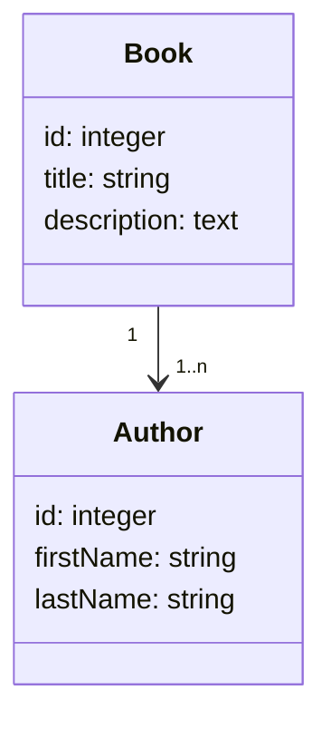

import Tabs from '@theme/Tabs'
import TabItem from '@theme/TabItem'

## Installer Doctrine

Dans un premier temps nous allons installer l'ORM doctrine.

Nous allons également installer le MakerBundle qui nous permettra de créer des entités, des contrôleurs et d'autres via une interface en ligne de commande (CLI).

```bash
# Installer le pack ORM contenant Doctrine
composer require symfony/orm-pack

# Installer MakerBundle
composer require --dev symfony/maker-bundle
```

:::info Note

L'utilisation de l'argument `--dev` permet d'installer le bundle en tant que dépendance de développement, ce qui signifie qu'il ne sera pas installé sur les serveurs de production.

:::

## Configuration de la connexion à la base de données

Pour que Doctrine puisse fonctionner, il faut lui spécifier les paramètres de connexion à la base de données. Pour cela, il faut modifier le fichier **.env** à la racine du projet.

Doctrine supporte les RDBMS suivants :

- PostgreSQL
- MariaDB
- MySQL
- SQLite
- Oracle

En fonction du type de RDBMS que vous utilisez, vous devez modifier la variable `DATABASE_URL` dans le fichier **.env** comme indiqué ci-dessous en remplaçant les valeurs signalées par un `$` :

```bash title=".env"
[...]
# PostgreSQL
DATABASE_URL="postgresql://$user:$password@$host:$port/$dbName?serverVersion=$version&charset=utf8"

# MariaDB et MySQL
DATABASE_URL="mysql://$user:$password@$host:$port/$dbName?serverVersion=$version&charset=utf8"

# SQLite -> Chemin vers le fichier de la base de données
DATABASE_URL="sqlite:///%kernel.project_dir%/var/data.db"

# Oracle
DATABASE_URL="oci://$user:$password@$host:$port/$dbName?serverVersion=$version&charset=utf8"
[...]
```

:::caution Attention aux caractères spéciaux

Si votre mot de passe, nom d'utilisateur ou si le nom de la base de donnée contient l'un ou plusieurs de ces caractères spéciaux :

- `espace` `!` `*` `‘` `(` `)` `[` `]` `;` `:` `@` `&` `=` `+` `$` `,` `/` `?` `%` `#` `{` `}` `<` `>`

Il vous faudra les encoder en utilisant le format RFC 3986 ou plus communément appelé `URL encode`. Pour cela vous pouvez utiliser le site : [URL Encoder](https://www.urlencoder.org/)

Exemple :

```bash
MotDePasse="my@Stro)ng!Pass=word@"
Encodage="my%40Stro%29ng%21Pass%3Dword%40"
```

:::

Si vous n'avez pas encore créer la base de donnée dans votre RDBMS, vous pouvez le faire en utilisant la commande suivante :

```bash
# Créer la base de donnée avec le nom spécifié dans la variable $dbName
php bin/console doctrine:database:create
```

:::tip

Il existe de nombreuses commandes pour gérer la base de données avec Doctrine, vous pouvez les lister en utilisant la commande suivante :

```bash
php bin/console list doctrine
```

:::

## Modèle de données

### Schématisation des entités

Prenons un exemple simple, nous allons créer une application qui permet de gérer des livres. Nous aurons donc besoin de deux tables :

- Une table `book` qui contiendra les informations relatives aux livres
- Une table `author` qui contiendra les informations relatives aux auteurs

Voici le schéma des ces entités :



Nous avons donc une relation `un à plusieurs` entre les entités `Book` et `Author`, un auteur peut avoir écrit plusieurs livres mais un livre ne peut avoir qu'un seul auteur.

### Création des entités

<Tabs>

<TabItem value='makerBundle' label='Avec MakerBundle' default>
Pour créer une entité avec le MakerBundle, il faut utiliser la commande suivante :

```bash
php bin/console make:entity
```

Il faut ensuite répondre aux questions suivantes :

```bash
Class name of the entity to create or update (e.g. AgreeablePizza):
> # Entrez le nom de l'entité

New property name (press <return> to stop adding fields):
> # Entrez le nom de la propriété, laissez vide pour arrêter d'ajouter des propriétés

Field type (enter ? to see all types) [string]:
> # Entrez le type de la propriété, laissez vide pour utiliser le type par défaut

Can this field be null in the database (nullable) (yes/no) [no]:
> # Entrez `yes` si vous souhaitez rendre la propriété nullable
```

:::info Note sur les propriétés

MakerBundle créé automatiquement une propriété `id` de type `integer` pour les entités.

Pour une propriété de type `string`, MakerBundler vous demandera quelle est la longueur souhaitée pour la propriété.

Pour une propriété de type `decimal`, MakerBundler vous demandera quelle est la précision et l'échelle souhaitée pour la propriété.

:::

:::tip Liste des types de propriétés

Il existe de nombreux types de propriétés, vous pouvez les lister en entrant `?` dans la question `Field type (enter ? to see all types) [string]:`

:::

Une fois que vous avez répondu à toutes les questions, le MakerBundle va créer la classe PHP dans le dossier `src/Entity` du projet.

</TabItem>

<TabItem value='scratch' label='Sans MakerBundle'>

Pour créer une entité, il faut créer une classe PHP dans le dossier `src/Entity` du projet.

Cette entité doit être annotée avec `Doctrine\ORM\Mapping\Entity` et optionnellement avec `Doctrine\ORM\Mapping\Table` pour spécifier le nom de la table dans la base de données.

Chaque propriété de la classe doit être annotée avec `Doctrine\ORM\Mapping\Column` accompagné de son type pour certains.

les types de propriétés sont les suivants :

<Tabs>

<TabItem value='typesPrincipaux' label='Types Principaux' default>

| Type de propriété | Description                | Options                          | Exemple d'annotation                   |
| ----------------- | -------------------------- | -------------------------------- | -------------------------------------- |
| **`string`**      | Chaîne de caractères       | `length` : Longueur de la chaîne | `#[ORM\Column(length: 255)]`           |
| **`text`**        | Chaîne de caractères       |                                  | `#[ORM\Column(type: Types::TEXT)]`     |
| **`boolean`**     | Booléen                    |                                  | `#[ORM\Column]`                        |
| **`integer`**     | Entier                     |                                  | `#[ORM\Column]`                        |
| **`smallint`**    | Entier                     |                                  | `#[ORM\Column(type: Types::SMALLINT)]` |
| **`bigint`**      | Entier                     |                                  | `#[ORM\Column(type: Types::BIGINT)]`   |
| **`float`**       | Nombre à virgule flottante |                                  | `#[ORM\Column]`                        |

</TabItem>

<TabItem value='objetsEtTableaux' label='Objets et tableaux'>

| Type de propriété  | Description | Exemple d'annotation                       |
| ------------------ | ----------- | ------------------------------------------ |
| **`array`**        | Tableau     | `#[ORM\Column(type: Types::ARRAY)]`        |
| **`simple_array`** | Tableau     | `#[ORM\Column(type: Types::SIMPLE_ARRAY)]` |
| **`json`**         | JSON        | `#[ORM\Column]`                            |
| **`object`**       | Objet       | `#[ORM\Column(type: Types::OBJECT)]`       |
| **`binary`**       | Binaire     | `#[ORM\Column(type: Types::BINARY)]`       |
| **`blob`**         | Binaire     | `#[ORM\Column(type: Types::BLOB)]`         |

</TabItem>

<TabItem value='datesEtHeures' label='Dates et heures'>

| Type de propriété  | Description               | Exemple d'annotation                             |
| ------------------ | ------------------------- | ------------------------------------------------ |
| **`date`**         | Date                      | `#[ORM\Column(type: Types::DATE_MUTABLE)]`       |
| **`datetime`**     | Date et heure             | `#[ORM\Column(type: Types::DATETIME_MUTABLE)]`   |
| **`datetimetz`**   | Date et heure avec fuseau | `#[ORM\Column(type: Types::DATETIMETZ_MUTABLE)]` |
| **`time`**         | Heure                     | `#[ORM\Column(type: Types::TIME_MUTABLE)]`       |
| **`dateinterval`** | Intervalle de date        | `#[ORM\Column]`                                  |

</TabItem>

<TabItem value='autresTypes' label='Autres types'>

| Type de propriété  | Description          | Options                                                                 | Exemple d'annotation                                           |
| ------------------ | -------------------- | ----------------------------------------------------------------------- | -------------------------------------------------------------- |
| **`guid`**         | GUID                 |                                                                         | `#[ORM\Column(type: Types::GUID)]`                             |
| **`decimal`**      | Nombre décimal       | `precision` : Précision de la valeur<br/>`scale` : Echelle de la valeur | `#[ORM\Column(type: Types::DECIMAL, precision: 10, scale: 2)]` |
| **`ascii_string`** | Chaîne de caractères |                                                                         | `#[ORM\Column(type: Types::ASCII_STRING)]`                     |

</TabItem>

</Tabs>

Créons maintenant nos deux entités `Book` et `Author` :

```php title="src/Entity/Book.php"
<?php

use Doctrine\ORM\Mapping as ORM;
use Doctrine\DBAL\Types\Types;

// Annotation pour spécifier que la classe est une entité
#[ORM\Entity]
class Book
{
    // Indique que la propriété est la clé primaire
    #[ORM\Id]
    // Indique que la valeur de la clé primaire est générée automatiquement
    #[ORM\GeneratedValue]
    #[ORM\Column]
    public ?int $id = null;

    // Propriété de type string avec une longueur de 255 caractères
    #[ORM\Column(length: 255)]
    public ?string $title = null;

    // Propriété de type TEXT
    #[ORM\Column(type: Types::TEXT)]
    public ?string $description = null;
}
```

```php title="src/Entity/Author.php"
<?php

namespace App\Entity;

use Doctrine\ORM\Mapping as ORM;

#[ORM\Entity]
class Author
{
    #[ORM\Id]
    #[ORM\GeneratedValue]
    #[ORM\Column]
    public ?int $id = null;

    #[ORM\Column(length: 255)]
    public ?string $firstName = null;

    #[ORM\Column(length: 255)]
    public ?string $lastName = null;
}
```

Vous voici maintenant avec vos deux entités qui sont prêtes à être utilisées.

</TabItem>

</Tabs>

### Création des relations

<Tabs>

<TabItem value='makerBundle' label='Avec MakerBundle' default>

:::info Rappel sur les relations

Il existe 4 types de relations entre les entités :

| Relation         | Notation | Description                                      | Exemple                                |
| ---------------- | -------- | ------------------------------------------------ | -------------------------------------- |
| **`OneToOne`**   | **1:1**  | Une entité est liée à une seule autre entité     | Un utilisateur a un seul profil        |
| **`OneToMany`**  | **1:n**  | Une entité est liée à plusieurs entités          | Un auteur a écrit plusieurs livres     |
| **`ManyToOne`**  | **n:1**  | Plusieurs entités sont liées à une entité        | Plusieurs livres ont un seul auteur    |
| **`ManyToMany`** | **n:n**  | Plusieurs entités sont liées à plusieurs entités | Plusieurs livres ont plusieurs auteurs |

:::

Pour réaliser la relation `un à plusieurs` entre les entités `Book` et `Author`, il vous suffira de spécifier le nom de la propriété de l'autre entité dans la question `New property name` de la commande `make:entity` et d'indiquer que son type est `relation` :

```bash title="Création de la relation dans l'entité Author"
Add another property? Enter the property name (or press <return> to stop adding fields):
> books # Nom de la propriété dans l'entité Author qui contiendra les livres de l'auteur

Field type (enter ? to see all types) [string]:
> relation # Le type pour réaliser la relation entre les entités

What class should this entity be related to?:
> Book # Nom de l'entité liée

Relation type? [ManyToOne, OneToMany, ManyToMany, OneToOne]:
> OneToMany # Type de relation

A new property will also be added to the Book class so that you can access and set the related Author object from it.
New field name inside Book [author]:
> author # Nom de la propriété dans l'entité Book qui contiendra l'auteur du livre

Is the Book.author property allowed to be null (nullable)? (yes/no) [yes]:
> yes
```

:::info Note

Le MakerBundle va automatiquement créer la propriété `books` dans l'entité `Author` et la propriété `author` dans l'entité `Book`.

:::

Vous voici maintenant avec deux entités qui sont liées entre elles.

</TabItem>

<TabItem value='scratch' label='Sans MakerBundle'>

Pour réaliser nos relations nous auront besoin d'ajouter des propriétés dans nos entités et de les annoter.

Il existe deux type d'annotation pour réaliser des relations :

- **Les annotations de relation**, elles servent à spécifier le type de relation et les options de la relation
- **Les annotations de jointure** elles servent à spécifier les colonnes de jointure.
  Elles ne sont utilisées que dans deux cas spécifique :
  - Lorsque la relation est de type `ManyToMany` ou `OneToMany`
  - Lorsque la relation est de type `ManyToOne` ou `OneToOne` et l'entité liée possède plusieurs clés primaires

Toutes les annotation de relations disposent des options suivantes :

- **`fetch`** : Permet de spécifier la stratégie de récupération des entités liées
  - `LAZY` : Les entités liées ne sont récupérées que lorsque vous accédez à la propriété
  - `EAGER` : Les entités liées sont récupérées en même temps que l'entité courante
- **`cascade`** : Permet de spécifier les opérations qui doivent être propagées aux entités liées
  - `persist` : Permet de persister les entités liées
  - `remove` : Permet de supprimer les entités liées
  - `merge` : Permet de fusionner les entités liées
  - `detach` : Permet de détacher les entités liées
  - `refresh` : Permet de rafraîchir les entités liées
  - `all` : Permet de propager toutes les opérations

Voici donc un récapitulatif des annotations de relation :

<Tabs>

<TabItem value='OneToMany' label='One To Many' default>

Pour créer une relation `OneToMany` entre deux entités, il faut ajouter une propriété dans l'entité qui contiendra plusieurs entités et l'annoter avec `Doctrine\ORM\Mapping\OneToMany`.

**`[ORM/OneToMany]`** permet de spécifier le type de relation et les options de la relation :

- Champ requis :
  - targetEntity : Le nom de l'entité liée
- Champs optionnels :
  - inversedBy : Le nom de la propriété dans l'entité liée qui contiendra les entités de l'entité courante
  - mappedBy : Le nom de la propriété dans l'entité courante qui contiendra les entités de l'entité liée
  - indexBy : Le nom de la propriété dans l'entité liée qui sera utilisée comme index pour les entités de l'entité courante
  - orphanRemoval : Permet de supprimer l'entité liée lorsque l'entité courante est supprimée

Voici un exemple de relation `OneToMany` entre les entités `Book` et `Author` :

```php title="src/Entity/Author.php"
<?php

use Doctrine\ORM\Mapping as ORM;

class Author
{
    #[ORM\OneToMany(targetEntity: Book::class, mappedBy: 'author')]
    public ?Collection $books = null;
}
```

```php title="src/Entity/Book.php"
<?php

use Doctrine\ORM\Mapping as ORM;

class Book
{
    #[ORM\ManyToOne(targetEntity: Author::class, inversedBy: 'books')]
    public ?Author $author = null;
}
```

</TabItem>

<TabItem value='ManyToMany' label='Many To Many'>

Pour créer une relation `ManyToMany` entre deux entités, il faut ajouter une propriété dans chaque entité et les annoter avec `Doctrine\ORM\Mapping\ManyToMany` et `Doctrine\ORM\Mapping\JoinTable`.

**`[ORM/JoinTable]`** permet de créer une table de jointure entre les deux entités, il faut alors spécifier :

- **`name`** : Le nom de la table de jointure
- **`joinColumns`** : Les colonnes de jointure de l'entité courante
- **`inverseJoinColumns`** : Les colonnes de jointure de l'entité liée

**`[ORM/ManyToMany]`** permet de spécifier le type de relation et les options de la relation :

- Champ requis :
  - targetEntity : Le nom de l'entité liée
- Champs optionnels :
  - inversedBy : Le nom de la propriété dans l'entité liée qui contiendra les entités de l'entité courante
  - mappedBy : Le nom de la propriété dans l'entité courante qui contiendra les entités de l'entité liée
  - indexBy : Le nom de la propriété dans l'entité liée qui sera utilisée comme index pour les entités de l'entité courante

Voici un exemple de relation `ManyToMany` entre les entités `Book` et `Author` :

```php title="src/Entity/Book.php"
<?php

use Doctrine\ORM\Mapping as ORM;

class Book
{
    #[ORM\JoinTable(
        name: 'author_book',
        joinColumns: ['name' => 'book_id','referencedColumnName' => 'id',],
        inverseJoinColumns: ['name' => 'author_id','referencedColumnName' => 'id',]
    )]
    #[ORM\ManyToMany(targetEntity: Author::class, inversedBy: 'books')]
    public ?Collection $authors = null;
}
```

```php title="src/Entity/Author.php"
<?php

use Doctrine\ORM\Mapping as ORM;

class Author
{
    #[ORM\ManyToMany(targetEntity: Book::class, mappedBy: 'authors')]
    public ?Collection $books = null;
}
```

</TabItem>

<TabItem value='OneToOne' label='One To One'>

Pour créer une relation `OneToOne` entre deux entités, il faut ajouter une propriété dans chaque entité et les annoter avec `Doctrine\ORM\Mapping\OneToOne`.

**`[ORM/OneToOne]`** permet de spécifier le type de relation et les options de la relation :

- Champ requis :
  - targetEntity : Le nom de l'entité liée
- Champs optionnels :
  - inversedBy : Le nom de la propriété dans l'entité liée qui contiendra l'entité de l'entité courante
  - orphanRemoval : Permet de supprimer l'entité liée lorsque l'entité courante est supprimée

Voici un exemple de relation `OneToOne` entre les entités `Book` et `Author` :

```php title="src/Entity/Book.php"
<?php

use Doctrine\ORM\Mapping as ORM;

class Book
{
    #[ORM\OneToOne(targetEntity: Author::class, inversedBy: 'book')]
    public ?Author $author = null;
}
```

```php title="src/Entity/Author.php"
<?php

use Doctrine\ORM\Mapping as ORM;

class Author
{
    #[ORM\OneToOne(targetEntity: Book::class)]
    public ?Book $book = null;
}
```

</TabItem>

<TabItem value='ManyToOne' label='Many To One'>

Pour créer une relation `ManyToOne` entre deux entités, il faut ajouter une propriété dans l'entité qui contiendra plusieurs entités et l'annoter avec `Doctrine\ORM\Mapping\ManyToOne`.

**`[ORM/ManyToOne]`** permet de spécifier le type de relation et les options de la relation :

- Champ requis :
  - targetEntity : Le nom de l'entité liée
- Champs optionnels :
  - inversedBy : Le nom de la propriété dans l'entité liée qui contiendra les entités de l'entité courante

Voici un exemple de relation `ManyToOne` entre les entités `Book` et `Author` :

```php title="src/Entity/Book.php"
<?php

use Doctrine\ORM\Mapping as ORM;

class Book
{
    #[ORM\ManyToOne(targetEntity: Author::class, inversedBy: 'books')]
    public ?Author $author = null;
}
```

```php title="src/Entity/Author.php"
<?php

use Doctrine\ORM\Mapping as ORM;

class Author
{
    #[ORM\OneToMany(targetEntity: Book::class, mappedBy: 'author')]
    public ?Collection $books = null;
}
```

</TabItem>

</Tabs>

</TabItem>

</Tabs>

## Effectuer une migration

Une fois que vous avez créé vos entités, il faut les migrer vers la base de données. Pour cela, il faut utiliser la commande suivante :

```bash
php bin/console doctrine:migrations:diff
```

Cette commande va générer un fichier de migration dans le dossier `src/Migrations` du projet. Ce fichier contient les requêtes SQL nécessaires pour créer les tables et les colonnes dans la base de données.

Il faut ensuite exécuter la migration avec la commande suivante :

```bash
php bin/console doctrine:migrations:migrate
```

Cette commande va exécuter les requêtes SQL du fichier de migration et créer les tables et les colonnes dans la base de données.
