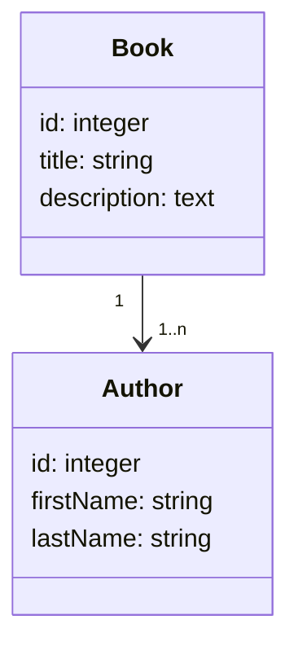

import Tabs from '@theme/Tabs'
import TabItem from '@theme/TabItem'

## Installer Doctrine

Dans un premier temps nous allons installer l'ORM doctrine.

Nous allons également installer le MakerBundle qui nous permettra de créer des entités, des contrôleurs et d'autres via une interface en ligne de commande (CLI).

```bash
# Installer le pack ORM contenant Doctrine
composer require symfony/orm-pack

# Installer MakerBundle
composer require --dev symfony/maker-bundle
```

:::info Note

L'utilisation de l'argument `--dev` permet d'installer le bundle en tant que dépendance de développement, ce qui signifie qu'il ne sera pas installé sur les serveurs de production.

:::

## Configuration de la connexion à la base de données

Pour que Doctrine puisse fonctionner, il faut lui spécifier les paramètres de connexion à la base de données. Pour cela, il faut modifier le fichier **.env** à la racine du projet.

Doctrine supporte les RDBMS suivants :

- PostgreSQL
- MariaDB
- MySQL
- SQLite
- Oracle

En fonction du type de RDBMS que vous utilisez, vous devez modifier la variable `DATABASE_URL` dans le fichier **.env** comme indiqué ci-dessous en remplaçant les valeurs signalées par un `$` :

```bash title=".env"
[...]
# PostgreSQL
DATABASE_URL="postgresql://$user:$password@$host:$port/$dbName?serverVersion=$version&charset=utf8"

# MariaDB et MySQL
DATABASE_URL="mysql://$user:$password@$host:$port/$dbName?serverVersion=$version&charset=utf8"

# SQLite -> Chemin vers le fichier de la base de données
DATABASE_URL="sqlite:///%kernel.project_dir%/var/data.db"

# Oracle
DATABASE_URL="oci://$user:$password@$host:$port/$dbName?serverVersion=$version&charset=utf8"
[...]
```

:::caution Attention aux caractères spéciaux

Si votre mot de passe, nom d'utilisateur ou si le nom de la base de donnée contient l'un ou plusieurs de ces caractères spéciaux :

- `espace` `!` `*` `‘` `(` `)` `[` `]` `;` `:` `@` `&` `=` `+` `$` `,` `/` `?` `%` `#` `{` `}` `<` `>`

Il vous faudra les encoder en utilisant le format RFC 3986 ou plus communément appelé `URL encode`. Pour cela vous pouvez utiliser le site : [URL Encoder](https://www.urlencoder.org/)

Exemple :

```bash
MotDePasse="my@Stro)ng!Pass=word@"
Encodage="my%40Stro%29ng%21Pass%3Dword%40"
```

:::

Si vous n'avez pas encore créer la base de donnée dans votre RDBMS, vous pouvez le faire en utilisant la commande suivante :

```bash
# Créer la base de donnée avec le nom spécifié dans la variable $dbName
php bin/console doctrine:database:create
```

:::tip

Il existe de nombreuses commandes pour gérer la base de données avec Doctrine, vous pouvez les lister en utilisant la commande suivante :

```bash
php bin/console list doctrine
```

:::

## Modèle de données

### Schématisation des entités

Prenons un exemple simple, nous allons créer une application qui permet de gérer des livres. Nous aurons donc besoin de deux tables :

- Une table `book` qui contiendra les informations relatives aux livres
- Une table `author` qui contiendra les informations relatives aux auteurs

Voici le schéma des ces entités :



Nous avons donc une relation `un à plusieurs` entre les entités `Book` et `Author`, un auteur peut avoir écrit plusieurs livres mais un livre ne peut avoir qu'un seul auteur.

### Création des entités

<Tabs>

<TabItem value='makerBundle' label='Avec MakerBundle' default>
Pour créer une entité avec le MakerBundle, il faut utiliser la commande suivante :

```bash
php bin/console make:entity
```

Il faut ensuite répondre aux questions suivantes :

```bash
Class name of the entity to create or update (e.g. AgreeablePizza):
> # Entrez le nom de l'entité

New property name (press <return> to stop adding fields):
> # Entrez le nom de la propriété, laissez vide pour arrêter d'ajouter des propriétés

Field type (enter ? to see all types) [string]:
> # Entrez le type de la propriété, laissez vide pour utiliser le type par défaut

Can this field be null in the database (nullable) (yes/no) [no]:
> # Entrez `yes` si vous souhaitez rendre la propriété nullable
```

:::info Note sur les propriétés

MakerBundle créé automatiquement une propriété `id` de type `integer` pour les entités.

Pour une propriété de type `string`, MakerBundler vous demandera quelle est la longueur souhaitée pour la propriété.

Pour une propriété de type `decimal`, MakerBundler vous demandera quelle est la précision et l'échelle souhaitée pour la propriété.

:::

:::tip Liste des types de propriétés

Il existe de nombreux types de propriétés, vous pouvez les lister en entrant `?` dans la question `Field type (enter ? to see all types) [string]:`

:::

Une fois que vous avez répondu à toutes les questions, le MakerBundle va créer la classe PHP dans le dossier `src/Entity` du projet.

</TabItem>

<TabItem value='scratch' label='Sans MakerBundle'>

Pour créer une entité, il faut créer une classe PHP dans le dossier `src/Entity` du projet.

Cette entité doit être annotée avec `Doctrine\ORM\Mapping\Entity` et optionnellement avec `Doctrine\ORM\Mapping\Table` pour spécifier le nom de la table dans la base de données.

Chaque propriété de la classe doit être annotée avec `Doctrine\ORM\Mapping\Column` et doit avoir un getter et un setter.

```php title="src/Entity/Book.php"
<?php

namespace App\Entity;

use Doctrine\ORM\Mapping as ORM;

#[ORM\Entity]
#[ORM\Table(name: "Book")]
class Book
{
    #[ORM\Id]
    #[ORM\GeneratedValue]
    #[ORM\Column(type: "integer")]
    private $id;

    #[ORM\Column(length: 255)]
    private $title;

    #[ORM\Column(length: 2000)]
    private $description;

    public function getId(): ?int
    {
        return $this->id;
    }

    public function getTitle(): ?string
    {
        return $this->title;
    }

    public function setTitle(string $title): self
    {
        $this->title = $title;

        return $this;
    }

    public function getDescription(): ?string
    {
        return $this->description;
    }

    public function setDescription(string $description): self
    {
        $this->description = $description;

        return $this;
    }
}
```

:::tip

Il existe de nombreuses annotations pour définir les propriétés de la classe, vous pouvez les retrouver dans la [documentation de Doctrine](https://www.doctrine-project.org/projects/doctrine-orm/en/2.9/reference/annotations-reference.html)

:::

```php title="src/Entity/Author.php"
<?php

namespace App\Entity;

use Doctrine\ORM\Mapping as ORM;


#[ORM\Entity]
#[ORM\Table(name: "Author")]
class Author
{

    #[ORM\Id]
    #[ORM\GeneratedValue]
    #[ORM\Column(type: "integer")]
    private $id;

    #[ORM\Column(length: 255)]
    private $firstName;

    #[ORM\Column(length: 255)]
    private $lastName;

    public function getId(): ?int
    {
        return $this->id;
    }

    public function getFirstName(): ?string
    {
        return $this->firstName;
    }

    public function setFirstName(string $firstName): self
    {
        $this->firstName = $firstName;

        return $this;
    }

    public function getLastName(): ?string
    {
        return $this->lastName;
    }

    public function setLastName(string $lastName): self
    {
        $this->lastName = $lastName;

        return $this;
    }
}
```

Vous voici maintenant avec vos deux entités qui sont prêtes à être utilisées.

</TabItem>

</Tabs>

### Création des relations

<Tabs>

<TabItem value='makerBundle' label='Avec MakerBundle' default>

:::info Rappel sur les relations

Il existe 4 types de relations entre les entités :

| Relation         | Notation | Description                                      | Exemple                                |
| ---------------- | -------- | ------------------------------------------------ | -------------------------------------- |
| **`OneToOne`**   | **1:1**  | Une entité est liée à une seule autre entité     | Un utilisateur a un seul profil        |
| **`OneToMany`**  | **1:n**  | Une entité est liée à plusieurs entités          | Un auteur a écrit plusieurs livres     |
| **`ManyToOne`**  | **n:1**  | Plusieurs entités sont liées à une entité        | Plusieurs livres ont un seul auteur    |
| **`ManyToMany`** | **n:n**  | Plusieurs entités sont liées à plusieurs entités | Plusieurs livres ont plusieurs auteurs |

:::

Pour réaliser la relation `un à plusieurs` entre les entités `Book` et `Author`, il vous suffira de spécifier le nom de la propriété de l'autre entité dans la question `New property name` de la commande `make:entity` et d'indiquer que son type est `relation` :

```bash title="Création de la relation dans l'entité Author"
Add another property? Enter the property name (or press <return> to stop adding fields):
> books # Nom de la propriété dans l'entité Author qui contiendra les livres de l'auteur

Field type (enter ? to see all types) [string]:
> relation # Le type pour réaliser la relation entre les entités

What class should this entity be related to?:
> Book # Nom de l'entité liée

Relation type? [ManyToOne, OneToMany, ManyToMany, OneToOne]:
> OneToMany # Type de relation

A new property will also be added to the Book class so that you can access and set the related Author object from it.
New field name inside Book [author]:
> author # Nom de la propriété dans l'entité Book qui contiendra l'auteur du livre

Is the Book.author property allowed to be null (nullable)? (yes/no) [yes]:
> yes
```

:::info Note

Le MakerBundle va automatiquement créer la propriété `books` dans l'entité `Author` et la propriété `author` dans l'entité `Book`.

:::

Vous voici maintenant avec deux entités qui sont liées entre elles.

</TabItem>

<TabItem value='scratch' label='Sans MakerBundle'>

Pour réaliser la relation `un à plusieurs` entre les entités `Book` et `Author`, il faut ajouter une propriété `author` dans la classe `Book` et une propriété `books` dans la classe `Author`.

:::info Rappel sur les relations

Il existe 4 types de relations entre les entités :

| Relation         | Notation | Description                                      | Exemple                                |
| ---------------- | -------- | ------------------------------------------------ | -------------------------------------- |
| **`OneToOne`**   | **1:1**  | Une entité est liée à une seule autre entité     | Un utilisateur a un seul profil        |
| **`OneToMany`**  | **1:n**  | Une entité est liée à plusieurs entités          | Un auteur a écrit plusieurs livres     |
| **`ManyToOne`**  | **n:1**  | Plusieurs entités sont liées à une entité        | Plusieurs livres ont un seul auteur    |
| **`ManyToMany`** | **n:n**  | Plusieurs entités sont liées à plusieurs entités | Plusieurs livres ont plusieurs auteurs |

:::

De la même manière qu'avec les propriétés, il faut fournir un getter et un setter pour chaque relation.

Il faut également annoter les propriétés avec `Doctrine\ORM\Mapping\ManyToOne` pour la relation `n:1` et `Doctrine\ORM\Mapping\OneToMany` pour la relation `1:n`.

```php title="src/Entity/Book.php"
<?php

namespace App\Entity;

use Doctrine\ORM\Mapping as ORM;

#[ORM\Entity]
#[ORM\Table(name: "Book")]
class Book
{
    //...

    #[ORM\ManyToOne(targetEntity: "App\Entity\Author", inversedBy: "books")]
    #[ORM\JoinColumn(nullable: false)]
    private $author;

    // ...

    public function getAuthor(): ?Author
    {
        return $this->author;
    }

    public function setAuthor(?Author $author): self
    {
        $this->author = $author;

        return $this;
    }
}
```

```php title="src/Entity/Author.php"
<?php

namespace App\Entity;

use Doctrine\ORM\Mapping as ORM;

#[ORM\Entity]
#[ORM\Table(name: "Author")]
class Author
{
    // ...

    #[ORM\OneToMany(targetEntity: "App\Entity\Book", mappedBy: "author")]
    private $books;

    // ...

    public function getBooks(): Collection
    {
        return $this->books;
    }

    public function addBook(Book $book): self
    {
        if (!$this->books->contains($book)) {
            $this->books[] = $book;
            $book->setAuthor($this);
        }

        return $this;
    }

    public function removeBook(Book $book): self
    {
        if ($this->books->contains($book)) {
            $this->books->removeElement($book);
            // set the owning side to null (unless already changed)
            if ($book->getAuthor() === $this) {
                $book->setAuthor(null);
            }
        }

        return $this;
    }
}
```

:::tip

Il existe de nombreuses annotations pour définir les relations entre les entités, vous pouvez les retrouver dans la [documentation de Doctrine](https://www.doctrine-project.org/projects/doctrine-orm/en/2.9/reference/annotations-reference.html)

:::

</TabItem>

</Tabs>

## Effectuer une migration

Une fois que vous avez créé vos entités, il faut les migrer vers la base de données. Pour cela, il faut utiliser la commande suivante :

```bash
php bin/console doctrine:migrations:diff
```

Cette commande va générer un fichier de migration dans le dossier `src/Migrations` du projet. Ce fichier contient les requêtes SQL nécessaires pour créer les tables et les colonnes dans la base de données.

Il faut ensuite exécuter la migration avec la commande suivante :

```bash
php bin/console doctrine:migrations:migrate
```

Cette commande va exécuter les requêtes SQL du fichier de migration et créer les tables et les colonnes dans la base de données.
