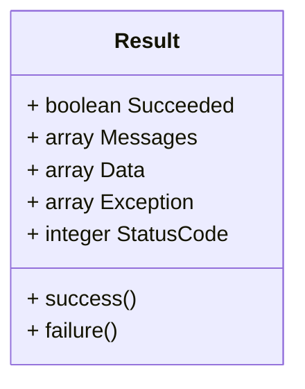

Pour répondre à une requête HTTP dans le cadre d'une API, nous allons créer un modèle de réponse.

Ce modèle permettra d'uniformiser les réponses de l'API, en ajoutant des informations supplémentaires à la réponse, comme le statut de la requête, le message de la requête, les données de la requête, etc...

## Schéma du modèle de réponse

Nous aimerions recevoir les informations utiles de nos réponses API dans un format standardisé incluant :

- Le statut de la requête (succès ou échec)
- Le ou les messages de la requête
- Les données de la requête
- Les erreurs de la requête (si la requête a échoué)
- Le code du status de la requête

Ce modèle devrait donc avoir deux méthodes :

- Success : qui permet de retourner une réponse de succès
- Failure : qui permet de retourner une réponse d'erreur

Voici donc le schéma de notre modèle de réponse :



## Création du modèle de réponse

Nous allons créer un dossier `common` dans le dossier `src` de notre projet Symfony.
Ce dossier contiendra tous les fichiers communs à notre projet.

Nous allons ensuite créer un fichier `Result.php` dans le dossier `common/Entity` de notre projet Symfony.

Ce fichier contiendra le modèle de réponse de notre API.

```php title="src/shared/Entity/Result.php"
<?php

namespace App\Shared\Entity;

use Exception;

class Result
{
   public bool $Succeeded;
   public array $Messages = [];
   public mixed $Data;
   public Exception $Exception;
   public int $StatusCode;

   public static function Success(mixed $data = null, array $messages = [], int $code = 200): Result
   {
      $result = new Result();
      $result->Messages = $messages;
      $result->Succeeded = true;
      $result->Data = $data;
      $result->StatusCode = $code;
      return $result;
   }

   public static function Failure(mixed $data, array $messages, Exception $exception = null, int $statusCode = 500): Result
   {
      $result = new Result();
      $result->Succeeded = false;
      $result->Data = $data;
      $result->Messages = $messages;
      $result->Exception = $exception;
      $result->StatusCode = $statusCode;
      return $result;
   }
}
```

## Utilisation du modèle de réponse

Pour répondre à une requête nous utiliserons maintenant notre modèle de réponse afin de générer une réponse standardisée :

```php title="src/Controller/HelloController.php"

<?php

# Génère une réponse de succès avec comme donnée la cha^ine de caractères Hello World !
# Et un message This is a success message !
$result = Result::Success('Hello World !', ['This is a success message !']);

# Génère une réponse d'erreur avec comme donnée null
# Et un message You are not allowed to access this resource !
# Et un code de status 403
$result = Result::Failure(null, ['You are not allowed to access this resource !'], null, 403);
```

Nous allons maintenant pouvoir utiliser ce modèle de réponse dans notre API.
