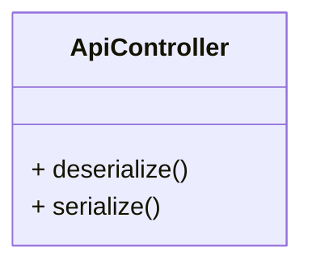

Par défaut, Symfony ne renvoie pas de réponse JSON lorsqu'une requête est effectuée sur une route de notre API, nous allons donc abstraire la logique de réponse de notre API dans un modèle de contrôleur qui sera une extension du modèle de contrôleur de Symfony.

De la même manière, Symfony ne désérialise pas les données JSON provenant des requêtes reçues.

## Schéma du modèle de contrôleur

Nous allons donc créer un modèle de contrôleur qui permettra de désérialiser les données JSON reçues et de sérialiser les données JSON à renvoyer.

Ce modèle devrait donc avoir deux méthodes :

- Deserialize : qui permet de désérialiser les données JSON reçues
- Serialize : qui permet de sérialiser les données JSON à renvoyer

Voici donc le schéma de notre modèle de contrôleur :



## Création du modèle de contrôleur

Pour créer notre modèle de controlleur, nous aurons besoin d'installer le composant `symfony/serializer` de Symfony.

```bash
composer require symfony/serializer
```

Nous allons créer un fichier `ApiController.php` dans le dossier `Controller` de notre projet Symfony.

Ce fichier contiendra le modèle de contrôleur de notre API.

```php title="src/Controller/ApiController.php"
<?php

namespace App\Controller;

use Symfony\Bundle\FrameworkBundle\Controller\AbstractController;
use Symfony\Component\HttpFoundation\JsonResponse;
use Symfony\Component\HttpFoundation\Request;
use Symfony\Component\HttpFoundation\Response;
use Symfony\Component\Serializer\SerializerInterface;

class ApiController extends AbstractController
{
    private SerializerInterface $_serializer;

   public function __construct(SerializerInterface $serializer)
   {
      $this->_serializer = $serializer;
   }

    public function deserialize(Request $request, string $entityClass): object
    {
        $data = json_decode($request->getContent(), true);

        return $this->_serializer->deserialize($request->getContent(), $entityClass, 'json');
    }

    public function serialize($data): JsonResponse
    {
        $json = $this->_serializer->serialize($data, 'json');

        return new JsonResponse($json, Response::HTTP_OK, [], true);
    }
}
```
