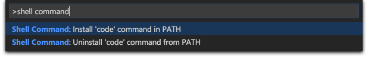
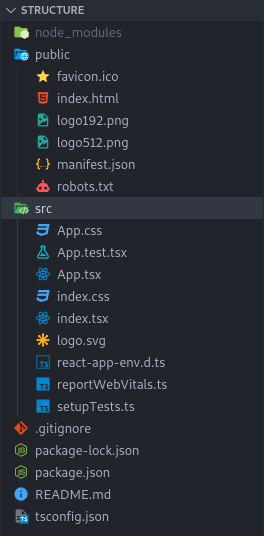

#### Popularité et longévité

React est la librairie frontend la plus utilisée devant Angular et Vue. React a été créée, est maintenue et est utilisée par Facebook, ce qui lui assure une grande fiabilité et une grande longévité.

#### Cross-Platform

L’apprentissage de React permet également de développer des applications mobiles sans grandes difficultés avec l’utilisation de React native qui reprends toutes les fonctionnalités de React à quelques différences près.

#### JSX

React embarque la syntaxe JSX qui n’est pas un langage mais simplement une syntaxe très simple qui permet d’intégrer du JavaScript au sein de la vue HTML.

#### Communauté

React dispose de la plus grande communauté frontend, ainsi les problèmes que vous rencontrerez aura sûrement déjà poser problème à d’autres utilisateur et il y a de fortes chances pour que vous trouviez une solution à votre problème.

## 2 – Installation et préparation

La manière la plus simple pour débuter un projet à l’aide de React est de créer un projet à l’aide du CLI fourni par les créateurs de react qui se nomme “Create react App”.

Une installation de Node est nécessaire afin d’utiliser cette commande.

Dans un terminal, nous pouvons donc utiliser les commandes de create react app :

- La commande de base pour créer un projet react est celle-ci :

```Shell
$ npx create-react-app le-nom-de-mon-app
```

- Nous préférerons cependant utiliser cette commande-ci qui nous génèrera un projet react avec TypeScript :

```Shell
$ npx create-react-app le-nom-de-mon-app --template typescript
```

"npx" est la commande de Node qui permet d’exécuter une commande issue d’un paquet sans avoir à installer le paquet en question.

Une fois l'initialisation de notre projet menée à son terme, create-react-app nous renvoie un message de succès et nous suggère d'exécuter différentes commandes.

Les commandes suggérées sont les suivantes :

- **npm start** → Permet de démarrer le serveur de développement
- **npm run build** → Permet de générer la version de production de notre application
- npm run test → Permet de lancer une batterie de test
- npm run eject → Permet de mettre en évidence des dépendances, des fichiers de configurations qui sont masqués par create-react-app

Nous allons donc pouvoir ouvrir le répertoire de notre application fraîchement créer directement depuis Visual Studio Code ou via le terminal à l'aide de ces commandes :

```Shell
$ cd le-nom-de-mon-app
$ code .
```

_Attention, la commande "code ." n'est pas disponible par défaut sur MacOS, veuillez-vous référer à la 4ème section de ce cours._

Puis nous pouvons ensuite depuis notre terminal ou directement depuis un terminal intégré de Visual Studio code exécuter la commande :

```Shell
$ npm start
```

Afin de démarrer notre serveur de développement.
Puis nous pouvons nous rendre à l'adresse http://localhost:3000 afin de visiter la page de notre projet !

## 3 – Installation de la commande code sur macOS

La commande code permet d'ouvrir un dossier dans Visual Studio Code depuis le terminal.

Pour installer la commande code, nous allons directement le faire depuis Visual Studio Code (VSC).

Pour ce faire, nous allons ouvrir la palette de commande de VSC avec _Command + Shift + P_ et taper : **'shell command'** pour trouver la commande **'Shell Command: Install 'code' command in PATH'**



Il ne vous restera plus qu'à redémarrer votre terminal pour pouvoir utiliser la commande code !

## 4 - Structure d'une application React

Une fois votre répertoire ouvert dans VSC, vous devrez obtenir une structure telle que celle-ci :



Nous y retrouvons alors :

- Le fichier **.gitignore** qui permet d'ignorer certains fichiers et dossiers lors de la publication sur git
- Le fichier **package.json** comme dans tout projet construit à partir de npm qui rescence les dépendances du projet et définit certains éléments de configuration du projet.
- Le fichier **tsconfig.json** qui recense nos réglages pour typescript
- Le dossier **node_modules** dans lequel se trouvent installées toutes les dépendances dont notre projet a besoin pour fonctionner
- Le dossier **public** dans lequel vous retrouverez quelques fichiers de base tels que **index.html** qui sera la page HTML racine lue par notre navigateur, **favicon.ico** qui correspond à l'icône affichée dans l'onglet du navigateur, **manifest.json** qui est un fichier de configuration qui permet d'appliquer certains paramètres sur certains appareils et **robots.txt** qui permet d'indiquer aux robots d'explorations des moteurs de recherche les urls auxquelles ils peuvent accéder sur notre site.
- Le dossier **src** dans lequel on va retrouver les fichiers pour développer notre application. On y retrouve des fichiers css, des fichiers relatifs aux tests, le fichier **index.tsx** qui correspond au fichier racine de l'application et le fichier **App.tsx** qui correspond au composant principal de notre application.

## 5 - Préparation de l'utilisation

Afin de travailler dans les meilleures conditions, nous allons faire un peu de ménage en supprimant tous les fichiers que nous n'utiliserons pas.

Nous pouvons alors désormais supprimer les fichiers :

- App.test.tsx
- setupTests.ts

Et enfin, nous allons également supprimer ces lignes dans le fichier package.json :

```json
"@testing-library/jest-dom": "^5.16.5",
"@testing-library/react": "^13.4.0",
"@testing-library/user-event": "^13.5.0",
"@types/jest": "^27.5.2",
```

data-color-mode="auto" data-light-theme="light" data-dark-theme="dark"
